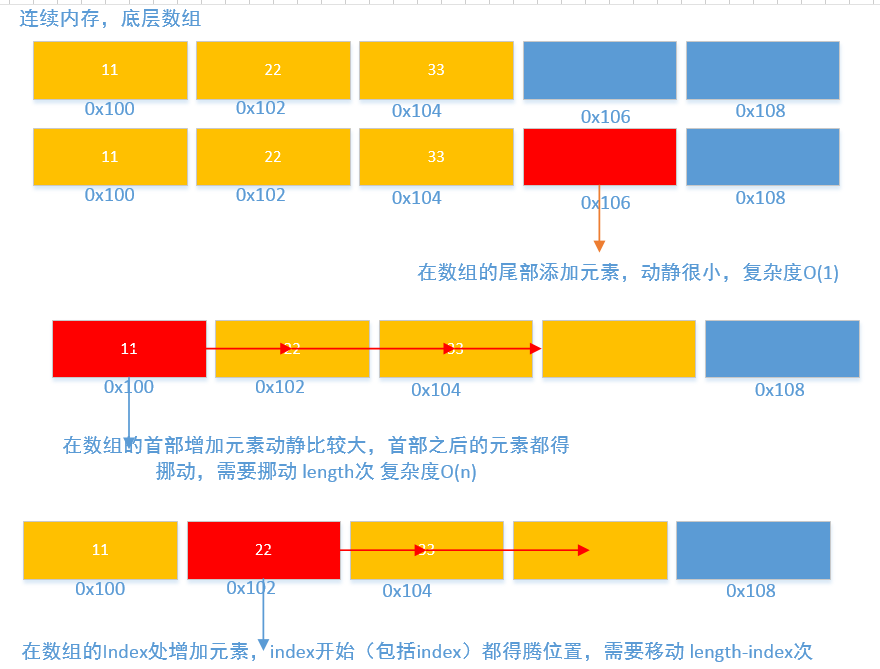
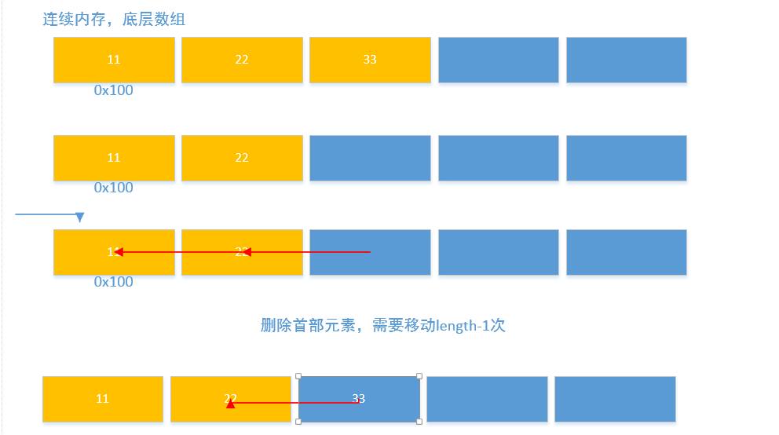

## Chapter 0 线性表

在数据结构中，前人根据编程经验，抽象出来几种经典的数据类型，数据类型是干什么的？其实就是用来存储数据的，存储不同的数据可能要用到不同的东西，这些不同的东西也叫做数据的容器。  这些容器大致上分为  线性表、树（为什么叫树呢）、图、串等等，其中线性表最简单。为什么说他最简单呢，因为它逻辑上就是数据单元组成的一长串数据。那么怎么把这些数据组成一条线呢?  **前人总结啊，无外乎就两种，得把每种数据放在一个内存单元中，那么怎么确定这些内存单元的联系呢，这些内存单元可以连续啊，找到第一个位置的数据，那么第二个位置的数据只需在第一个位置加上地址偏移即可；当这些单元的地址没有规律，不连续时怎么办呢?那么必须得找一种方法让他们之间发生关系，可以让一个数据带有下一个数据的地址啊，也就是我有下一个数据的位置。**  

**我们可以打个比方，比如说我去找人，当我们去一个村子里找人时，怎么找啊？两种方法，从村东头开始，一家一家问，你是xx吗？人说不是，就不搭理你了，好吧你着去第二家，人说不是，你又得去第三家，，，。，，，**  
**我们可以换另外一种方法，还是问人家,你是xxx吗？人说不是。咱脸皮比较厚，接着问，那你知道它在哪吗？人说它在xxx家，你就接着去xxx家，这样就是第二中的方法啊。**  

让我们看看两种线性结构的图示：  

**途中的黄色部分，即存有下一个数据节点所在的内存位置，这样就可以把这些分散的数据串起来了。**  

### 0.1 线性表的抽象数据类型

**有了数据的基本抽象，那么我们接下来要干什么呢》对这些数据进行操作啊？怎么操作，操作啥吗？给你数据你能干啥，增加数据，删除数据，分析数据啊，查找数据，修改数据啊，简单说来就是增删该查；因为两种数据结构不一样，所以操作方式也不一样，下面我们就分两种数据来讨论。**

线性表的抽象数据类型定义如下： 
	
	ADT  线性表（List)
	
	Data 
		
		线性表的数据对象集合为（a1,a2,....an),每个元素的类型均为DataType。
		其中除第一个元素a1外，每一个元素有且只有一个前驱元素，除了最后一个元素an外，每一个元素有且只有一个直接猴急元素。
	
	Operation
		
		InitList() :初始化操作，建立一个空的线性表L
		
		IsEmpty() :若线性表为空，返回true，否则返回false
		
		ClearList()  将线性表清空
		
		getElement(index):返回线性表的第i个位置的元素、
	
		contain(element)：在线性表中查找与给定值相等的元素，如果存在返回对应的索引，否则返回-1
		
		insert(i,element)：在线性表第i个位置插入新元素
		
		pop(index) ： 删除线性表index位置的元素
		
		length()  返回线性表元素的个数

### 0.2线性表的顺序存储结构

**因为顺序存储结构，地址是连续的，所以可以借助数组来实现。但是数组有个问题，就是定义数组的时候啊，必须先确定数组的长度，一旦数组的长度确定了，数组的长度就不能修改了，当我们在数组中存储的数据长度较小的时候，还可以，但是当存储数据的长度较多时，怎么办呢？让数组扩容吧，其实这种扩容也就是重新申请一个数组，然后把新数组的引用赋值给旧的数组。** 

**下面就来分析增删该查的几种方法：** 
增 
先来看看增加元素，有两个问题要解决，增什么，怎么增？也就是怎么干的问题。我们有一长串的数据是吧，把这个新的数据增加到哪里呢？无外乎三个地方，长串的首部，长串的尾部，长串的其余部分。是吧?  

**其实超长串的尾部添加最简单，为什么呢？新元素直接放到长串的最后，其余的元素不用动，前提是数组能放的下（要考虑健壮性的问题，也就是扩容性问题）。**  

**那么超数组的头部增加元素，我们想一想，其实动静挺大的，原数组的第一个节点咋办啊？原数组的第一个节点得朝后挪挪了吧，去第二个位置吧，那原数组的第二个节点怎么办呢，去第三个吧，这就相当于土匪里来了个能人啊，能人要当老大，那原来的老大只能当老二了。操作的时候，要从后往前操作，也就是最后一个元素先朝后挪，倒数第二个元素再往后挪。那么要懂多少次呢？原来的元素有多少就动多少部啊。**  

**超数组的其余位置增加元素呢，其实和超数组的头部增加是一样的啊？比如超index处增加元素，index（注意包括index)开始到最后的元素都得朝后移动动，得操作length-index次，在首部添加等价于index为0啊。**  

代码实现：  

		//像数组中添加元素，向末尾添加
	public void add(String element) {
		//当数组中的元素达到数组长度的一半时扩容
		if(length>size/2) {
			reSize(size+size/2);
			this.size = size+size/2;
		}
		//weilength个位置处赋值，因为索引从0开始，而Length时从1开始的
		arr[length] = element; 
		length++;
	}
	
	//向数组中添加元素，在指定索引位置处添加
	public void add(int index,String element) {
		checkRange(index);
		//当数组中的元素达到数组长度的一半时扩容
		if(length>size/2) {
			reSize(size+size/2);
			this.size = size+size/2;
		}
		
		//从index开始之后（包括的每一个元素朝后移动一位，从后面开始动）,需要移动length-index次
		for(int i = length;i>index;i--) {
			arr[i] = arr[i-1];
		}
		
		//在index处赋上新的值
		arr[index] = element;
		length++;
	}

删 

**删按照位置来说也有3种，首部，尾部，其他位置，删除尾部很简单的。删除首部和删除其余位置很简单，就是挪位置，把待删除位置的值给覆盖即可，与增加的区别就是操作顺序，是从index+1开始把之后的元素超前一次覆盖即可，需要操作(length-index-1）次。**br>  

		//删除list中的元素,把index开始（不包括index)的所有元素朝前面移动一位即可,覆盖掉Index处的值即可，需要移动length-index-1次
	public void remove(int index) {
		checkRange(index);
		for(int i =index+1;i<length;i++) {
			arr[i-1] = arr[i];
		}
		length--;
	}

改 

**修改就很简单了** 

查 

**查找也很简答** 

					//返回某个元素的索引值，
		public int index(String element) {
			
			//如果元素为空
			if(element==null) {
				//遍历数组中的元素
				for(int i =0;i<length;i++) {
					if(arr[i]==null) {
						return i;
					}
				}
				
			}else {
				//遍历数组中的元素
				for(int i =0;i<length;i++) {
					if(arr[i].equals(element)) {
						return i;
					}
				}
			}
			return -1;
			
		}
		
		
		//list是否包含某个元素
		public boolean contains(String element) {
			return index(element)!=-1;
		}

### 0.2线性表的链式存储结构

同线性表的顺序存储结构一样，线性表的链式存储结构方法也包含增删该查的方法，下面我们来分析。  

增 

	

**添加节点的时候，必须先生成一个空节点，然后再进行操作。**  

**当向链表的尾部添加节点的时候，直接让（1）原先的最后一个节点新生成的节点；（2）然后让最后的指针指向最后的节点**  

**当向链表的头部添加节点时，直接让（1）新生成的节点指向原先的第一个接待你；(2)然后让第一个指针执向最新的节点。**  

**在其余位置处，让（1)新生成的节点指向待原来Index节点(2)让index-1节点指向新生成的节点**关键是获取index-1处的节点，可以写一个方法按照索引获取节点。  
		

			//在index节点处插入值，这里就需要分析在头部插入值，在尾部插入值，在其他的位置插入值
	public void insert(int index,String element) {
		//健壮性检查
		checkRange(index);
		//向链表的首部添加节点
		if(index==0) {
			//方法的拆分
			push(element);
			if(length==1) {
				last = first;
			}
		//向链表的尾部添加节点
		}else if(index==length-1) {
			//方法的拆分
			add(element);
			if(length==1) {
				first = last;
			}
		//向链表的中间部分添加节点
		}else {
			//获取待插入节点之前的一个节点
			Node beforeNode = index(index-1);
			//待插入的新节点 
			Node newNode = new Node();
			//设置新节点的数据
			newNode.setData(element);
			//设置新节点的下一个节点
			newNode.setNext(beforeNode.getNext());
			//设置新节点的上一个节点
			beforeNode.setNext(newNode);
			length++;
		}
		
	}
	
	
	//在链表的头部插入值
	public void push(String element) {
		//创建新的节点
		Node newNode = new Node();
		//设置新节点的值
		newNode.setData(element);
		//因为在链表的头部插入值，所以新生成的节点下一个节点为 之前链表的第一个节点
		newNode.setNext(first);
		
		//设置新的节点为头部节点
		first = newNode;
		
		//链表的长度自增
		length++;
	}
	
	//在链表的尾部插入值
	public void add(String element) {
		//创建新的节点
		Node newNode = new Node();
		//设置新节点的值
		newNode.setData(element);
		//设置新节点的下一个值
		newNode.setNext(null);
		//将新节点添加到原来节点的尾部
		last.setNext(newNode);
		
		//将新节点生命为尾部节点
		last = newNode;
		
		length++;
		
	}

删 
 

**删除尾部节点的时候直接让尾部节点为null,让倒数第二个节点为尾部节点即可**  
**删除首部节点的时候，直接让首部节点为null,让第二个节点为首部节点**  

**删除其余位置的节点，让index-1也就是待删除的前一个节点指向待删除的后一节点即可**  

	//按照索引删除节点
	public void remove(int index) {
		checkRange(index);
		//删除头结点 
		if(index==0) {
			pop();
			
		//删除尾部及诶按
		}else if(index==length-1) {
			delete();
		}else {
			//获取待删除之前的节点s
			Node beforeNode = index(index-1);
			//将待删除之前的节点直接指向待删除节点之后的节点，这样就没哟指向待删除节点的指针
			beforeNode.setNext(beforeNode.getNext().getNext());
			length--;
		}
		
		
	}
	
	//删除链表中的第一个节点
	public void pop() {
		
		Node oldFirst = first;
		oldFirst = null;
		//将新的节点设置为原来第二个节点
		first = first.getNext();
		length--;
	}
	
	//删除链表的最后一个节点
	public void delete() {
		
		//获取倒数第二各节点
		Node newLast = index(length-2);
		
		System.out.println(newLast.getData());
		
		newLast.setNext(null);
		//将最后的一个节点设置为倒数第二个节点
		last = newLast;
		length--;
		
	}

改，查 

**改查的方法都要便利链表获取index处的节点，所以要先提取出一个方法，在这个方法的基础上操作就简单多了**  

**方法：工作指针后移** 
	
		/**
	 * 
	 * @param index
	 * @return
	 */
	//获取index处的Node，这个方法的复杂度为O(N) 查找index处的节点，这个方法比较重要
	public Node index(int index) {
		checkRange(index);
		//遍历链表
		Node currentNode = first;
		//遍历链表，注意 迭代的次数 为Index次
		for(int i =0;i<index;i++) {
			currentNode = currentNode.getNext();
		}
		return currentNode;
		
	}

**分析：至此，我们初步分析完了这两种数据结构的方法，可以看出来对于数组行的线性表来说，增删元素比较麻烦，因为它要动其他的元素，而对于链表不需要修改其他的元素；查找元素的话数组比较快，而链表比较慢。因此数组使用 修改查询比较多的，而链表使用于增加删除比较多**  

###0.3、循环链表 

**将单链表中终端节点的指针端由空指针指向头结点，就使得整个单链表形成一个环，这种头尾相接的单链表称为单循环链表，称为循环链表（Circular linkedlist)**  

**其实循环链表和单链表的主要差异就在于循环的判断条件上，原来的判断条件是p->next是否为空，现在则是p->nedxt不等于头结点，则循环未结束。**  

 **增删该查对于一般的元素是一样的，有区别的仅仅是 首尾的元素。因此仅仅需要对首位元素加以注意** 

--------
 **增** 

	//在index节点处插入数据
	public void insert(int index,String data) {
		//没有进行index值的检查
		//向头部添加节点
		if(index==0) {
			push(data);
		//向尾部添加节点
		}else if(index==length) {
			add(data);
		}else {
			//向其余位置添加元素，和普通的链表没有区别
			Node beforeNode = getNode(index-1);
			
			Node newNode = new Node();
			newNode.setData(data);
			newNode.setNext(beforeNode.getNext());
			beforeNode.setNext(newNode);
			length++;
		}
		
		
		
	}
	
	
	
	//在头添加节点
	public void push(String data) {
		
		Node newNode = new Node();
		newNode.setData(data);
		
		//如果之前为空链表
		if(length==0) {
			first = last = newNode;
			last.setNext(first);
		}else {
			
			last.setNext(newNode);
			newNode.setNext(first);
			first = newNode;
		}
		length++;
		
		
		
	}
	
	//在尾部添加节点
	public void add(String data) {
		//先生成一个新的节点
		Node newNode = new Node();
		//设置节点的数据
		newNode.setData(data);
		//如果之前为空链表
		if(length==0) {
			first = last = newNode;
			last.setNext(first);
		}else {
			last.setNext(newNode);
			newNode.setNext(first);
			last = newNode;
		}
		
		length++;
		
		
	}
	

 **删** 

	

	//删除链表任意位置的节点
	public void remove(int index) {
		
		if(index==0) {//删除首部节点
			pop();
		}else if(index==length-1) {//删除尾部节点
			delete();
		}else {//删除其余位置的节点
			Node beforeNode = getNode(index-1);
			//待删除之前的一个节点直接指向指向待删除节点的下一个节点
			beforeNode.setNext(beforeNode.getNext().getNext());
		}
		
	}
	
	
	//删除链表的首部节点
	public void pop() {
		
		if(length==0) {
			throw new IllegalArgumentException("索引出错");
		}else {
			//新的首部节点
			Node newFirst = first.getNext();
			first.setNext(null);
			last.setNext(newFirst);
			first = newFirst;
			length--;

		}
		
		
	}
	
	
	//删除链表的尾部节点
	public void delete() {
		
		if(length==0) {
			throw new IllegalArgumentException("索引出错");
		}else {
			//新的尾部节点
			Node newLast = getNode(length-2);
			System.out.println(newLast.getData());
			newLast.setNext(first);
			last = newLast;
			length--;
		}
		
	}

**其余的方法和普通的链表基本一样** 
******************************************
**************************************

### 0.4、 双向链表
**在单链表中，有了next指针，这就使得我们要查找下一个节点的时间复杂度为O(1).可是如果我们要查找的是上一个节点的话，那么最坏的时间复杂度就是O(n)了，因为我们每次都要从头开始遍历查找。**   
**为了克服单向性这一缺点，提出一种双向链表。双向链表是在单链表的每个节点中，再设置一个指向其前区节点的指针域.所以在双向链表中的节点都有两个指针域，一个指向后继，另一个指向直接前驱。**  

**双向链表是单链表扩展出来的结构，所以它的很多操作和单链表相同，比如求指针的长度，查找元素，获得元素的位置，这些操作都主要涉及一个方向的指针即可，另一个指针多了也不能提供什么帮助**  

**在插入和删除时，需要更改两个指针变量。**  

**双向链表的指针工作量通常是单链表的2呗。** 

**增：通常要修改四个指针**  

**要注意指针的修改顺序**  

	//向链表index处增加节点
	public void insert(int index,String data) {
		//不用进行健壮性检查
		if(index==0) {//首部添加
			push(data);
		}else if(index ==length-1) {//尾部添加
			add(data);
		}else {
			//获取待index-1处的接待你
			Node beforeNode = getNode(index-1);
			//新的节点
			Node newNode = new Node();
			//设置数据
			newNode.setData(data);
			
			//设置新生成节点的关系
			newNode.setPrior(beforeNode);
			newNode.setNext(beforeNode.getNext());
			
			
			beforeNode.getNext().setPrior(newNode);
			beforeNode.setNext(newNode);
			
			length++;
			
			
		}
		
		
		
		
	}
	
	
	//向链表的尾部增加节点
	public void add(String data) {
		if(length==0) {//空节点
			Node node = new Node();
			node.setData(data);
			node.setNext(node);
			node.setNext(node);
			first = last = node;
			
		}else {
			//新的节点
			Node newNode = new Node();
			newNode.setData(data);
			//原先的最后一个节点
			Node oldLast = last;
			
			//四部赋值
			oldLast.setNext(newNode);
			newNode.setPrior(oldLast);
			
			newNode.setNext(first);
			first.setPrior(newNode);
			last = newNode;
			
		}
		
		length++;
	}
	
	//向链表的头部a增加节点
	public void push(String data) {
		//原先是空的节点
		if(length==0) {//空节点
			Node node = new Node();
			node.setData(data);
			node.setNext(node);
			node.setNext(node);
			first = last = node;
			
		}else {
			//新的节点
			Node newNode = new Node();
			newNode.setData(data);
			//原先的最后一个节点
			Node oldFirst = first;
			//四部赋值
			oldFirst.setPrior(newNode);
			newNode.setNext(first);
			
			newNode.setPrior(last);
			last.setNext(newNode);
			first = newNode;
		}
		
		length++;
	}
	

**删：通常要修改二个指针**  

	//按照索引删除节点
	public void remove(int index) {
		//删除首部接单
		if(index==0) {
			
			pop();
				
		//删除尾部节点
		}else if(index==length-1) {
			delete();
		//删除其余位置处的节点
		}else {
			Node beforeNode = getNode(index-1);
			
			beforeNode.setNext(beforeNode.getNext().getNext());
			beforeNode.getNext().getNext().setPrior(beforeNode);
			length--;
		}
		
	}
	
	
	//删除尾部节点
	public void delete() {
		if(length==0) {
			throw new IllegalArgumentException("索引位置错误");
		}else {
			Node newLast = getNode(length-2);

			newLast.setNext(first);
			first.setPrior(newLast);
			last = newLast;
			length--;
		}
		
	}
	
	
	//删除首部节点
	public void pop() {
		
		if(length==0) {
			throw new IllegalArgumentException("索引位置错误");
		}else {
			Node newFirst = first.getNext();
			
			newFirst.setPrior(last);
			last.setNext(newFirst);
			first = newFirst;
			length--;
		}
		
	}
	
### 0.5小结
 
**在本文中，我们学习了一种数据结构:线性表，按照底层的组成又可以分为顺序线性表和链式线性表。顺序线性表的底层就是数组，在操作的时候比较难的一点就是数组的长度必须是固定的，这就牵扯到扩容与数组索引越界的e问题；**  

**而链表时一个一个节点所组成，每个节点由数据与指针组成，我们可以按照指针的各种类型将链表再次细分，如果最后一个节点的指针指向NULL这就是最简单的链表；如果最后一个节点的指针指向头结点那这就是循环链表；如果每个节点有两个指针，即前向指针和后项指针，那这就是双向链表。**  

**对于线性表的常规操作就是增删该查，在数组中比较简单，主要难的就是数组的拷贝，与数组的扩容，记住下面几条结论**：  

* 在index处插入节点，index9包括之后的节点往后挪（从后往前)需要移动(length-index）次
* 删除index处节点，index之后的数据往前挪即可(从前往后)需要移动(length-index-1)次

**对于链表的操作：抓住节点Node与指针的指向，对链表的头部，链表的尾部，链表的其他地方增删该查分清情况进行讨论，增加节点时，先生辰新的节点，然后分析其前后指针的值该怎么设置；删除节点的时，要小心。无论增加还是删除，都要先获得index-1也就是待插入或待删除节点的前一个节点，这样可以方便操作**  

